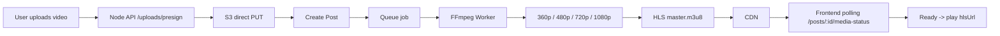

# Media Adaptive Transcoding Design

## Aim

Apne app me har screen ke liye internet speed ke hisaab se media quality select karni hai, bina user experience ko break kiye.

Goal:
- video/audio/image ko optimized quality me serve karna
- slow network par low bitrate quality
- fast network par high bitrate quality
- backend driven transcoding + frontend status polling
- backend aur frontend dono ke liye consistent contract

---

## Core idea

### 1) Upload time
Video upload hone ke baad backend worker file ko transcode karta hai.

Example quality ladder:
- 360p
- 480p
- 720p
- 1080p

### 2) Playback time
Frontend network speed detect karta hai aur backend ko recommended quality request bhejta hai.

### 3) Delivery
HLS player normal adaptive playback karta hai, aur backend quality recommendation sirf guidance ke liye use hoti hai.

> Important: Frontend ko hardcoded `/api/v1/hls/.../master.m3u8` route nahi banana chahiye. 
> Backend se `hlsUrl` milna chahiye, phir hi player ko dena chahiye.

---

## Recommended stack

- Frontend: React Native
- Backend: Node.js / Express / Nest
- Queue: Redis + BullMQ
- Transcoder: FFmpeg
- Storage: S3 / Cloudflare R2
- CDN: CloudFront / Cloudflare CDN
- Streaming: HLS
- Metadata DB: MongoDB

---

## System flow



---

## Network quality profile

### Network speed mapping

| Network speed | Recommended profile | Suggested quality |
| --- | --- | --- |
| < 0.5 Mbps | low | 360p |
| 0.5 - 1.5 Mbps | balanced | 480p |
| 1.5 - 4 Mbps | good | 720p |
| > 4 Mbps | high | 1080p |

### Backend API

```http
GET /api/v1/uploads/quality-profile?networkSpeedMbps=4
```

Response:

```json
{
  "data": {
    "networkSpeedMbps": 4,
    "networkProfile": "balanced",
    "recommendedQuality": "480p",
    "maxResolution": "480p"
  }
}
```

### Purpose
- app ko network ke hisaab se expected quality pata chalta hai
- UI previews / prefetch decisions karne me help milti hai
- HLS player adaptive switching ke liye anchor signal deta hai

---

## Adaptive media recommendation API

### Endpoint

```http
POST /api/v1/uploads/adaptive
```

### Request

```json
{
  "mediaUrl": "https://cdn.example.com/uploads/user-id/file.mp4",
  "mediaKind": "video",
  "networkSpeedMbps": 4
}
```

### Response

```json
{
  "data": {
    "recommendedUrl": "https://cdn.example.com/uploads/user-id/480p/video.mp4"
  }
}
```

### Use case
- direct image/video CDN URL ke liye
- slow network par alternate optimized URL choose karna
- HLS URL ko bypass karna, kyunki HLS already adaptive hai

> HLS master URL ke liye /uploads/adaptive use nahi karna chahiye. 
> HLS URLs are already adaptive; they should be used as-is.

---

## Post creation flow

### Endpoint

```http
POST /api/v1/posts
```

### Request

```json
{
  "mediaKind": "short_video",
  "file": {
    "key": "uploads/user-id/file.mp4",
    "bucket": "bucket-name",
    "contentType": "video/mp4",
    "size": 5242880,
    "originalName": "my-video.mp4",
    "url": "https://cdn.example.com/uploads/user-id/file.mp4"
  },
  "caption": "My video",
  "hashtags": "#video",
  "mediaWidth": 1080,
  "mediaHeight": 1920,
  "durationSeconds": 35,
  "originalAudioMuted": false
}
```

### Response

```json
{
  "data": {
    "post": {
      "id": "post-id",
      "mediaKind": "short_video",
      "mediaProcessingStatus": "processing",
      "hlsUrl": null,
      "hlsVariants": [],
      "mediaProcessingError": null
    }
  }
}
```

---

## Media status polling

### Endpoint

```http
GET /api/v1/posts/{postId}/media-status
```

### Processing state

```json
{
  "data": {
    "postId": "post-id",
    "mediaKind": "short_video",
    "status": "processing",
    "hlsUrl": null,
    "variants": [],
    "error": null
  }
}
```

### Ready state

```json
{
  "data": {
    "postId": "post-id",
    "mediaKind": "short_video",
    "status": "ready",
    "hlsUrl": "https://cdn.example.com/uploads/.../master.m3u8",
    "variants": [
      {
        "quality": "360p",
        "width": 640,
        "height": 360,
        "bitrateKbps": 500,
        "playlistUrl": "https://cdn.example.com/.../360p/index.m3u8"
      },
      {
        "quality": "720p",
        "width": 1280,
        "height": 720,
        "bitrateKbps": 1800,
        "playlistUrl": "https://cdn.example.com/.../720p/index.m3u8"
      }
    ],
    "error": null
  }
}
```

### Status values

- `processing` -> backend transcoding in progress
- `ready` -> HLS manifest available, playback safe
- `failed` -> processing error
- `not_required` -> image/audio excluded from HLS

---

## Frontend behavior by screen

### 1) Feed screen

Use case:
- list item video preview
- show poster while processing
- when status `ready`, replace with HLS URL

Rules:
- use `mediaProcessingStatus`
- if `ready` and `hlsUrl` exists, set video source to `hlsUrl`
- if still processing, keep original uploaded video or poster
- if `failed`, show error fallback + poster

### 2) Full-screen video viewer

Use case:
- swipe through reels / feed video player
- show highest possible quality once ready

Rules:
- poll status every 3-5 seconds while visible
- stop polling once `ready` or `failed`
- use `hlsUrl` only

### 3) Story / short video screen

Use case:
- story clips or short reels

Rules:
- same polling pattern as feed
- only HLS ready-url should be passed to player
- no manual quality param injection

### 4) Profile / saved / trending feed

Use case:
- all post lists and user profiles

Rules:
- same feed behavior
- if `mediaProcessingStatus === 'ready'`, use `hlsUrl`
- else fallback to original source or poster

### 5) Chat / preview attachments

Use case:
- shared media preview

Rules:
- if media is image, use image URL
- if video, only play when backend marks `ready`
- do not hardcode quality variations in chat preview

---

## Backend implementation plan

### Upload endpoint

```http
POST /api/v1/uploads/presign
```

Purpose:
- generate signed S3 URL
- return `uploadUrl`, `key`, `bucket`, `contentType`, `url`

### Media create endpoint

```http
POST /api/v1/posts
```

Purpose:
- save metadata
- set `mediaProcessingStatus = processing`
- enqueue worker job

### Transcoding queue job

Flow:
1. read source file from S3
2. run FFmpeg to generate variants
3. generate master.m3u8
4. upload outputs to CDN/S3
5. update Post record with:
   - status = ready
   - hlsUrl
   - variants
   - error = null

### Poll endpoint

```http
GET /api/v1/posts/:postId/media-status
```

Purpose:
- frontend status polling
- ready / failed / processing state reporting

---

## FFmpeg quality ladder example

```bash
ffmpeg -i input.mp4 \
  -vf scale=w=640:h=360:force_original_aspect_ratio=decrease \
  -c:v libx264 -preset veryfast -crf 28 -c:a aac -movflags +faststart \
  -f hls -hls_time 4 -hls_playlist_type vod -hls_segment_filename 360p/%03d.ts 360p/index.m3u8

ffmpeg -i input.mp4 \
  -vf scale=w=1280:h=720:force_original_aspect_ratio=decrease \
  -c:v libx264 -preset veryfast -crf 23 -c:a aac -movflags +faststart \
  -f hls -hls_time 4 -hls_playlist_type vod -hls_segment_filename 720p/%03d.ts 720p/index.m3u8
```

### Master manifest example

```m3u8
#EXTM3U
#EXT-X-VERSION:3
#EXT-X-STREAM-INF:BANDWIDTH=500000,RESOLUTION=640x360
360p/index.m3u8
#EXT-X-STREAM-INF:BANDWIDTH=1800000,RESOLUTION=1280x720
720p/index.m3u8
```

---

## Quality recommendation rules

### Backend algorithm

```ts
function getProfile(networkSpeedMbps: number) {
  if (networkSpeedMbps < 0.5) return { profile: 'low', quality: '360p' };
  if (networkSpeedMbps < 1.5) return { profile: 'balanced', quality: '480p' };
  if (networkSpeedMbps < 4) return { profile: 'good', quality: '720p' };
  return { profile: 'high', quality: '1080p' };
}
```

### Frontend usage

```ts
const profile = await fetchQualityProfile(networkSpeed);
// use profile.recommendedQuality for UI hints
// always use returned backend hlsUrl for actual playback
```

---

## Acceptance criteria

### Backend
- [ ] upload presign works
- [ ] direct S3 PUT works
- [ ] post creation returns `processing`
- [ ] worker produces 360p/480p/720p/1080p variants
- [ ] master manifest generated
- [ ] media-status returns `ready` when done
- [ ] failed state handled gracefully

### Frontend
- [ ] network speed profile request works
- [ ] feed content uses original URL while processing
- [ ] when `ready`, player uses `hlsUrl`
- [ ] no hardcoded `/api/v1/hls/...` paths in app
- [ ] no manual `/uploads/transcode` call from client
- [ ] all screens use same polling logic

---

## Final rule

Use this policy everywhere:

- Upload and create post -> immediate
- Transcode on backend -> background worker
- Playback only when `media-status` is `ready`
- HLS `hlsUrl` used directly
- Network quality recommendation used only for hints / optimization
- No manual client-side transcoding call in app

---

## Recommended implementation order

1. Backend upload + presign + create-post
2. Redis queue + FFmpeg worker
3. HLS output generation
4. media-status endpoint
5. frontend polling logic
6. quality profile + adaptive hints
7. all screens adopt common player logic

This makes the app production-friendly and consistent across feed, profile, story, and viewer screens.
