# Multiflix Media Processing and Playback Flow

## Purpose

Multiflix app me media processing backend handle karta hai. Frontend ka kaam media upload karna, processing status check karna aur backend se mile ready URL ko play karna hai.

## Complete flow

```mermaid
flowchart LR
    A[User selects media] --> B[Frontend requests presigned upload URL]
    B --> C[Frontend uploads file directly to storage]
    C --> D[Frontend creates content]
    D --> E[Backend marks media as processing]
    E --> F[Backend worker runs transcoding]
    F --> G[Backend creates HLS variants]
    G --> H[Backend returns ready status and hlsUrl]
    H --> I[Frontend plays backend URL]
```



## Frontend responsibility

- Presigned upload URL lena.
- File ko storage par direct upload karna.
- Post, blog, story, music ya doosra content create karna.
- `media-status` endpoint ko poll karna jab tak processing complete na ho.
- `status = ready` hone par backend ka `hlsUrl` use karna.
- Image ya non-HLS media ke liye backend ka `recommendedUrl` use karna, jab available ho.
- Processing ke dauran poster ya original fallback dikhana.

Frontend khud transcoding nahi karta aur manually HLS URL construct nahi karta.

## Backend responsibility

- Uploaded source file ko queue me daalna.
- FFmpeg worker se media transcode karna.
- Internet speed ke alag profiles ke liye media variants banana, jaise 360p, 480p, 720p aur 1080p.
- HLS master playlist aur segments generate karna.
- Output ko storage/CDN par upload karna.
- Database me processing status, `hlsUrl`, variants aur error save karna.
- `media-status` response me final playback URL dena.

## Internet speed behavior

HLS player available variants me se network ke hisaab se quality automatically switch karta hai. Frontend quality profile ya adaptive recommendation ka use hints aur non-HLS media selection ke liye karta hai.

| Network speed | Suggested profile | Expected quality |
| --- | --- | --- |
| `< 0.5 Mbps` | low | 360p |
| `0.5 - 1.5 Mbps` | balanced | 480p |
| `1.5 - 4 Mbps` | good | 720p |
| `> 4 Mbps` | high | 1080p |

Ye mapping backend recommendation ke liye hai. Actual HLS playback `hlsUrl` ke through player manage karta hai.

## Status behavior

| Status | App behavior |
| --- | --- |
| `processing` | Polling continue; poster ya fallback source show |
| `ready` | Backend ka `hlsUrl` player ko pass |
| `failed` | Error/fallback UI show; retry policy backend par depend |
| `not_required` | Original image/audio/media URL use |

## Screen coverage

Same backend-driven flow in screens par apply hota hai:

- Home feed
- Full-screen video viewer
- Stories aur short videos
- Profile aur saved posts
- Trending content
- Blog media
- Music media
- Chat/shared media previews

Har screen ko backend response se URL lena chahiye. Kisi screen ko `/hls/...`, quality query parameter ya manual transcoding endpoint khud nahi banana chahiye.

## Important API contract

### Upload

```http
POST /api/v1/uploads/presign
```

### Content creation

```http
POST /api/v1/posts
```

Content create hone ke baad backend processing start karta hai.

### Processing status

```http
GET /api/v1/posts/{postId}/media-status
```

Ready response ka important field:

```json
{
  "status": "ready",
  "hlsUrl": "https://cdn.example.com/media/master.m3u8"
}
```

### Adaptive recommendation

```http
POST /api/v1/uploads/adaptive
```

Ye endpoint non-HLS media ke liye recommended URL de sakta hai. HLS ke liye returned `hlsUrl` ko direct use karna hai.

## What the client can be told

> Multiflix me media transcoding backend worker handle karta hai. App upload ke baad processing status check karti hai aur ready hone par backend ka adaptive HLS URL play karti hai. Isliye supported media content network condition ke hisaab se suitable quality me deliver hota hai.

## Important limitation

Frontend integration ready hai, lekin actual transcoding quality aur HLS output tabhi available hoga jab backend worker, FFmpeg pipeline, storage aur CDN properly configured aur running hon. Frontend backend ke response ko consume karta hai; frontend khud missing HLS output create nahi kar sakta.
